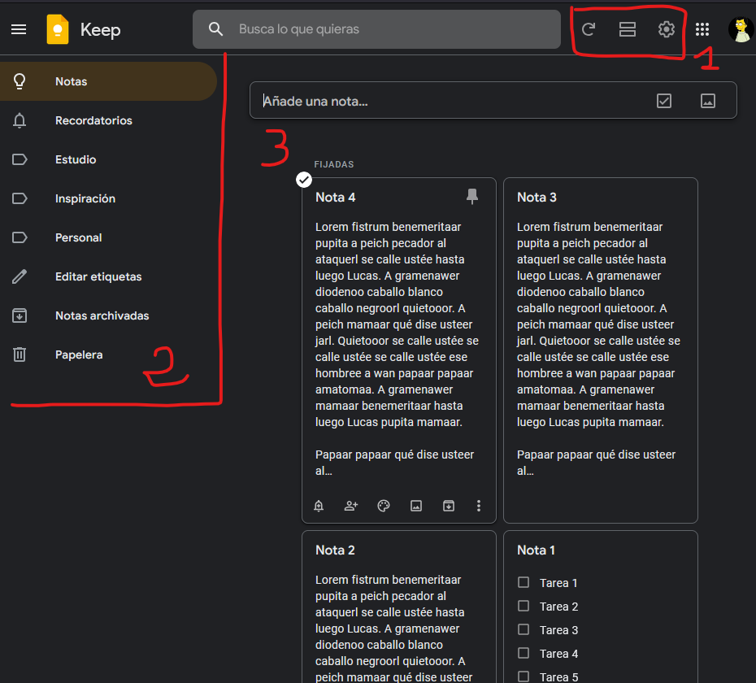
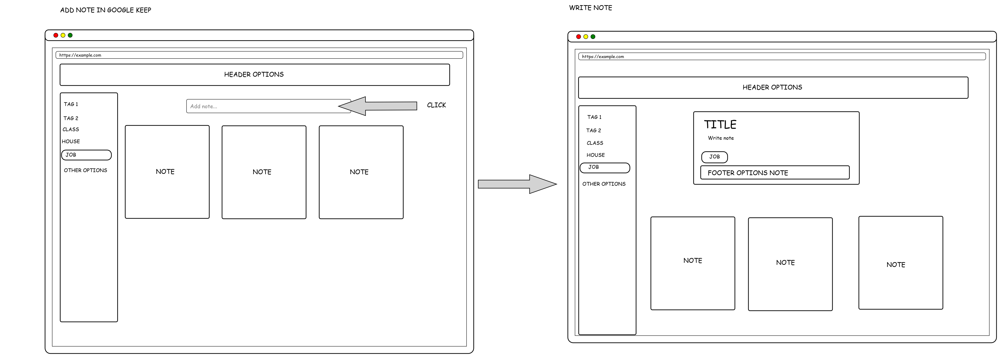

# Modulo 0 - Layout

## Parte 1

### 1º Elegid una app o servicio que uséis con frecuencia que os encante.

La app elegida es **Google Keep**

### 2º Hacer una evaluación heurística analizando cómo cumplen los principios (de la 1 a la 10 poned ejemplos de cómo se representan dichos principios, sugerid mejoras si lo consideráis).

| Principio Heurístico                    | Flujo / elemento                                        | Correcto / Incorrecto                                                                                                                                                                 | Severidad | Frecuencia |
| --------------------------------------- | ------------------------------------------------------- | ------------------------------------------------------------------------------------------------------------------------------------------------------------------------------------- | --------- | ---------- |
| Visibilidad del sitema                  | Transiciones                                            | Tiene transiciones que indican que el sistema está funcionando.                                                                                                                       | -         | -          |
|                                         | Icono de carga                                          | Muestra el estado de las actualizaciones de las notas con el servidor.                                                                                                                | -         | -          |
|                                         | Barra de carga                                          | Al entrar en la cuenta de google.                                                                                                                                                     | -         | -          |
| Coincidencia entre mundo real y sistema | Iconos y textos                                         | Corresponden a la forma en que archivarimos las notas en un mundo real.                                                                                                               | -         | -          |
| Control y libertad del usuario          | Deshacer una acción                                     | Permite deshacer acciones realizadas en las notas.                                                                                                                                    | -         | -          |
|                                         | Deshacer eliminar una nota                              | Durante un tiempo muestra un _"toast"_ para deshacer la acción de enviar una nota a la papelera.                                                                                      | -         | -          |
|                                         | Guardado automático                                     | Guarda los cambios realizados automáticamente, en este tipo de aplicación lo considero algo positivo, puesto que evita tener que "perder" el tiempo en hacer la acción de guardado.   | -         | -          |
|                                         | Salir                                                   | Permite cerrar sesión de la cuenta de Google.                                                                                                                                         | -         | -          |
| Consistencia y estándares               | Menús                                                   | Toda la apliación conserva el mismo sistema de diseño.                                                                                                                                | -         | -          |
|                                         | Iconos                                                  | Utiliza iconos estandarizados en la industria, como puede ser el menú de "hamburguesa".                                                                                               | -         | -          |
| Prevención de errores                   | Placeholders                                            | Indica inequívocamente para que sirven los _inputs_ visibles.                                                                                                                         | -         | -          |
|                                         | Comprobación de errores en línea                        | No es necesario realizar una comprobación de errores debido a la naturaleza de los inputs, pueden aceptar cualquier dato.                                                             | -         | -          |
| Reconocimiento antes que memoria        | Orden de acciones de menú                               | Tiene un orden de acciones del más probable uso al de menos.                                                                                                                          | -         | -          |
|                                         | Historial de actividad                                  | Las notas tienen un historial de versiones                                                                                                                                            | -         | -          |
|                                         | Iconografía con etiquetas                               | El menú principal tiene la iconografía con etiquetas, el menú secuandario muestra el texto al posicionar el puntero encima de los icónos.                                             | -         | -          |
|                                         | Información de _shortcuts_ en contexto de la acción     | No dispone de indicadores de _shortcuts_ según las acciones que se estén realizando                                                                                                   | Muy Baja  | Siempre    |
|                                         | _Tooltips_                                              | Dispone de _tooltips_ para facilitar la compresión de la acción a realizar                                                                                                            | -         | -          |
| Flexibilidad y eficiencia de uso        | Contenido frecuente                                     | Dependiendo de la nota que se esté creando, ayuda con autocomplementado                                                                                                               | -         | -          |
|                                         | Atajos de teclado                                       | Dispone de atajos de teclado                                                                                                                                                          | -         | -          |
|                                         | Personalización                                         | Permite personalizar las notas, posicionamiento, etiquetas...                                                                                                                         | -         | -          |
| Estética y diseño minimalista           | Uso del espacio blanco                                  | Tiene un buen espacio en blanco, no está sobrecargada                                                                                                                                 | -         | -          |
|                                         | Balance de textos e imágenes                            | No tiene imágenes (solo el logo de la aplicación y el avatar del usuario), con lo que no sobrecarga la interfaz                                                                       | -         | -          |
|                                         | Layout eficaz                                           | Cumple con las expectativas de posicionamiento de las notas, creación rápida, personalización...                                                                                      | -         | -          |
| Recuparación de errores                 | Informar de la situación                                | No he conseguido forzar un fallo o error en la aplicación                                                                                                                             | -         | -          |
|                                         | Solicitar confirmación de borrado                       | No solicita confirmación de envío de una nota a la papelera pero si del vaciado de la misma. Debido a que es una aplicación que se requiere rapidez de uso, no se considera un fallo. | -         | -          |
| Ayuda y documentación                   | Tiene una extensa sección de ayuda y un foro de soporte | -                                                                                                                                                                                     | -         | -          |

## Parte 2

### 1º Rescatar ejemplos de esa app sobre cómo cumplen con los principios de diseño (Leyes de Gestalt)

Ley de la **proximidad**: La aplicación tiene 3 áreas bien diferenciadas por la proximidad entre los elementos.

1. Configuración y estado de la aplicación
2. Menú de filtro de notas
3. Área de trabajo

Ley de **similitud**: Aunque las notas se puedan cambiar de color, la forma y estructura (título y cuerpo de la nota) siempre serán iguales. Las etiquetas que se añaden en el menú 2, siempre tienen el mismo icóno permitiendo la identificación del texto como una etiqueta.

Ley de la **región común**: En este ejemplo, la ley de la región común es idéntico a la de proximidad. Las opciones y área de trabajo están claramente identificadas y separadas.

Ley de la **figura-fondo**: El _input_ que nos permite crear una nota está claramente diferenciado con el fondo indicando que es posible realizar una acción. Además las notas se pueden apreciar correctamente porque se ven que están por encima del fondo.

Ley de **destino común**: El menú 2 se puede ocultar dejando visible solo los iconos y las notas se pueden desplazar, llevando con ellas las opciones y contenido.

### 2º Haced un prototipo de bajo nivel tratando de representar lo que para vosotros sería el flujo principal de interacción y uso (cualquier herramienta, podéis entregar pdf, png o enlace donde se vea la secuencia de interacción)

He creado un _mockup_ con la aplicación [quickmock](https://quickmock.net/) que indica el flujo para crear una nota nueva:

## Parte 3

1º Rediseñar (alta fidelidad) alguna pantalla creando los componentes completos en Figma (haciendo uso de autolayout, variantes, tokens, etc).
